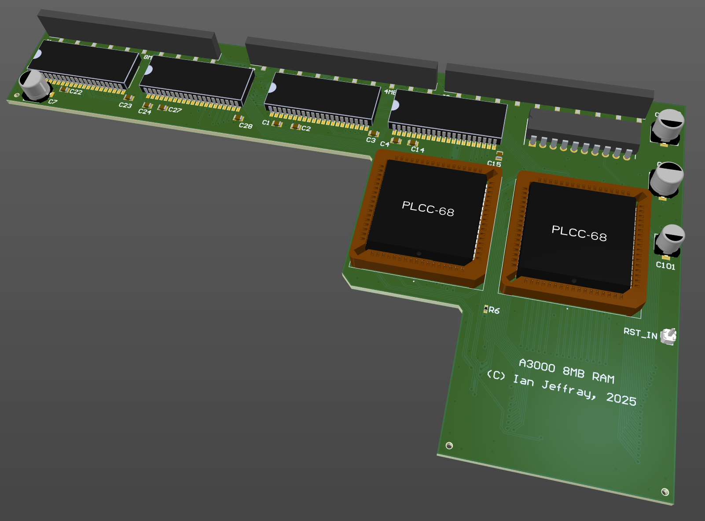

# Acorn A3000 8MB RAM board

May 2025

An 8MB RAM upgrade for Acorn A3000 machines.  The PAL, IC71, is a copy from that found in the Acorn A540.

This has been built and tested and works well, but does still need the motherboard reset line to ARM severed and looped to this board, so ARM reset can be controlled from this board -- still looking in to solutions for that.

An updated version using through-board SMT headers for the data bus has NOT been built yet.  This should solve the issue of board alignment - allowing the board to sit perfectly parallel with the motherboard, hopefully reducing issues with MEMC socket contact.

## Licence

No warranty is provided, and this work is used at your own risk.  

Licenced as CC BY-SA 4.0

Copyright 2025 Ian Jeffray

